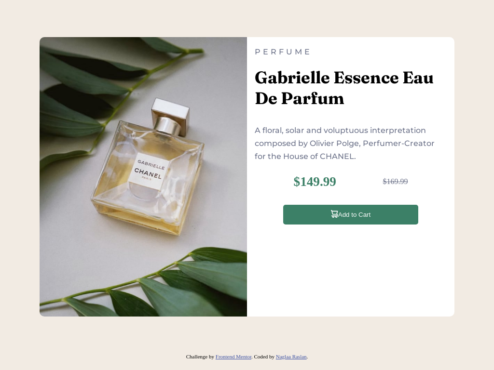
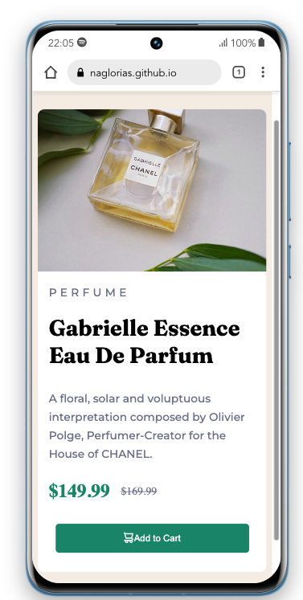

# Frontend Mentor - Product preview card component solution

This is a solution to the [Product preview card component challenge on Frontend Mentor](https://www.frontendmentor.io/challenges/product-preview-card-component-GO7UmttRfa). Frontend Mentor challenges help you improve your coding skills by building realistic projects. 

## Table of contents

- [Overview](#overview)
  - [The challenge](#the-challenge)
  - [Screenshot](#screenshot)
  - [Links](#links)
- [My process](#my-process)
  - [Built with](#built-with)
  - [What I learned](#what-i-learned)
  - [Continued development](#continued-development)
  - [Useful resources](#useful-resources)
- [Author](#author)
- [Acknowledgments](#acknowledgments)

## Overview

### The challenge

Users should be able to:

- View the optimal layout depending on their device's screen size
- See hover and focus states for interactive elements

### Screenshot
- Desktop screenshot 

- Mobile screenshot 

### Links

- Solution URL: [Add solution URL here](https://naglorias.github.io/product-card/)
- Live Site URL: [Add live site URL here](https://github.com/naglorias)

## My process

### Built with

- Semantic HTML5 markup
- CSS custom properties
- Flexbox
- CSS Grid
- Desktop-first workflow

### What I learned

I learned how to adjust heights and widths with padding and margins of elements;
I learned how to use grid layout and flexbox layout as well.
I confirmed learning how to use media queries and how to adjust the elements to be
meet user devices screens whether they are desktop or mobile screens;

## Author

- Website - [Naglaa Raslan](https://github.com/naglorias)
- Frontend Mentor - [@naglorias](https://www.frontendmentor.io/profile/naglorias)
